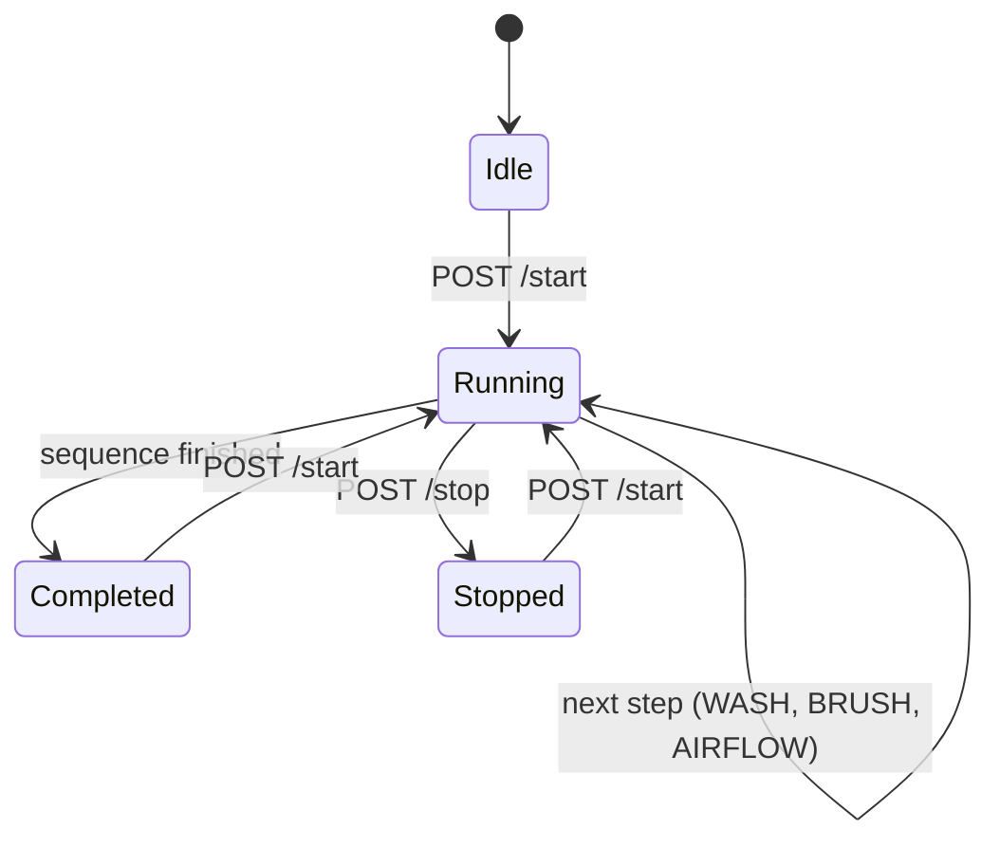

# Car Wash Machine

An ESP8266 (NodeMCU) sketch that drives a small automated car wash. A motor moves the wash carriage along the car while relays switch the water/soap pump, the brush, and the drying fan in sequence. The machine is started and stopped from a web page served by the board over Wi-Fi.

## How it works

The carriage runs a 10 step sequence forward (4 wash, 3 brush, 3 airflow), then walks the same steps back in reverse. An ultrasonic sensor keeps the carriage in range: under 7 cm it drives one way, over 20 cm it drives the other.

## Wiring

| Pin | Connected to |
|-----|--------------|
| D5 | Motor driver PWM (speed) |
| D6 | Motor driver IN1 |
| D7 | Motor driver IN2 |
| D8 | Water/soap relay |
| D0 | Brush relay |
| D2 | Fan relay |
| D3 | Ultrasonic TRIG |
| D4 | Ultrasonic ECHO |

## Setup

1. Install the ESP8266 board package in the Arduino IDE.
2. Set `ssid` and `password` in `car_wash_machine.ino`.
3. Flash the sketch and open the serial monitor at 9600 baud to get the board's IP address.
4. Open `http://<board-ip>/` and use **Start** or **Emergency Stop**.
